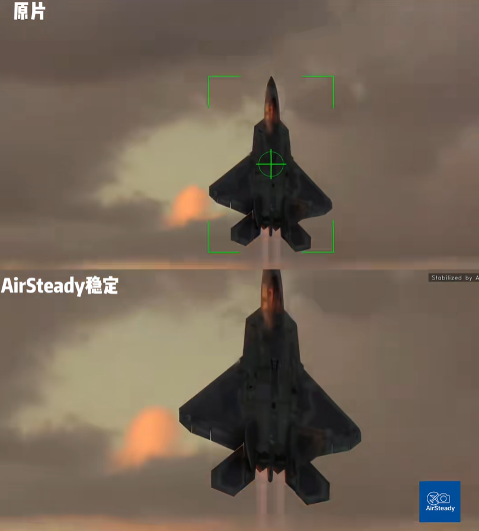

# 如何用 YOLO + SLAM 思想做了一个航空稳拍工具

> 给拍飞机、航模、打鸟的人：让长焦手抖、主体乱飘的视频变得"像有云台一样好看"

---

## 演示视频

### 1. 软件使用演示

[](https://www.bilibili.com/video/BV1AodfByEnP/)

### 2. F-22 处理前后对比

[](https://www.bilibili.com/video/BV1ivmaBvE4q/)

> 点击图片到 B 站观看高清视频

更多作品：[抖音 @AirSteady](https://www.douyin.com/user/MS4wLjABAAAAkB0g12Ry0z-bBjHmGffv-JpfWJpEF_BR2wQumAR2grnhn1S4SuS7KmV761Bi8Iid?from_tab_name=main) |

开源代码： [GitHub @ydsf16/AirSteady](https://github.com/ydsf16/AirSteady)

---

## 动机：一个航空爱好者的痛点

我是一个航空爱好者，经常去各地看航空展——珠海航展、长春空军开放日、新加坡航展……每次都会拍一堆视频。

但有个问题一直困扰我：**航空摄影视频的抖动非常严重**。我们真心希望飞机主体能稳定在画面的某个位置，而不是跟着镜头乱飘。

要实现稳定，传统方案有两种：

1. **前期硬件**：沉重的三脚架 + 顶级跟拍技术 + 昂贵设备
2. **后期软件**：达芬奇、AE 等专业软件

但后处理软件的使用门槛很高，而且有个**致命缺陷**：**人工参与度太高**。

具体流程是这样的：
- 在飞机上选一个跟踪点
- 跟踪失败了 → 暂停 → 人工重新选点
- 再失败 → 再选……

整个过程需要反复介入，而且选点的技巧很关键——选在机身边缘容易丢，选在机翼上可能跟踪不稳。

> 其实在这之前，我甚至还不知道有达芬奇、AE 这类软件。看完航展我就在想：**这个问题能不能用算法自动解决？**

后来写了 demo 验证，才发现已经有专业软件能做这件事。但它们的交互方式让我思考：**能不能做一个更自动化、更垂直的工具？**

---

## 技术思路：从目标跟踪到轨迹优化

### 稳定的本质

拍摄飞机时，我们希望**飞机在画面中相对静止**。

原理很简单：如果能稳定跟踪飞机在图像坐标系下的运动，然后反向补偿这些运动，那么飞机在视频里看起来就是"不动"的。

```
稳定输出帧 = 原始帧 - 飞机运动位移
```

但核心难点是：**如何稳定地跟踪飞机的运动？**

### 现有专业软件的方案

我研究了一下，专业软件大概有两种思路：

**方案一：单点光流跟踪**

在飞机上选一个点，用 Patch Match 或 KLT 光流跟踪。

> **问题**：飞机做机动动作时，机身相对相机会有转动，单点很容易丢失。

**方案二：多点光流跟踪**

在飞机上撒一堆点，用光流同时跟踪这些点。点少了就动态补点。

> **优势**：鲁棒性更好，个别点丢失不影响整体。

但问题来了：**如何确保这些点只撒在飞机上，而不是背景？**

### 我的方案：YOLO 分割 + 光流跟踪 + 图优化

我的思路是结合两者的优势：

```
┌─────────────────────────────────────────────────────────────┐
│  输入视频                                                   │
│       ↓                                                     │
│  ┌─────────────────┐                                        │
│  │ YOLO 分割检测    │ → 获取飞机粗糙的全局坐标 (bbox/mask)    │
│  └────────┬────────┘                                        │
│           ↓                                                 │
│  ┌─────────────────┐                                        │
│  │ 在 mask 内撒点   │ → GFTT 特征点提取                       │
│  └────────┬────────┘                                        │
│           ↓                                                 │
│  ┌─────────────────┐                                        │
│  │ KLT 光流跟踪    │ → 获取帧间相对位移 (odom)               │
│  └────────┬────────┘                                        │
│           ↓                                                 │
│  ┌─────────────────┐                                        │
│  │ PoseGraph 优化  │ → 全局轨迹 (检测中心作为约束)           │
│  └────────┬────────┘                                        │
│           ↓                                                 │
│  输出平滑轨迹 → 反向补偿 → 稳定视频                          │
└─────────────────────────────────────────────────────────────┘
```

**核心思想**：

- **光流跟踪** → 提供帧间位移（类似 SLAM 中的 odom）
- **YOLO 检测中心** → 提供全局位置约束（类似 SLAM 中的 loop closure）
- **图优化** → 用稀疏最小二乘法融合两者，输出全局不漂移的轨迹

有了这条轨迹，我们就可以反向平移图像，实现视频稳定。通过设置**平滑系数**，还能控制"跟随 vs 稳定"的权衡。

---

## 实现细节与待解决问题

### 1. 单个飞机跟踪 ✅

单个目标场景很简单，对飞机持续跟踪 + 补偿即可。

当前代码已实现，效果稳定。

### 2. 多个飞机怎么办？🔧

如果是编队飞行，用户可能想跟踪不同的飞机（比如长机 → 僚机切换）。

**我的想法**：
- UI 交互让用户选择不同时刻要跟踪的主体
- 后台用最小二乘平滑轨迹切换
- 支持"多目标锁定"，用户可指定优先级

**待实现，欢迎有兴趣的同学一起搞！**

### 3. YOLO 模型需要微调 🔧

现有 COCO 预训练模型对飞机的识别效果一般，尤其是：
- 远距离小目标
- 复杂背景（云层、地面）
- 特殊角度（侧视、俯视）

**计划**：
- 收集航空/航模/打鸟视频数据集
- 微调 YOLO 模型（fine-tune）
- 支持用户自定义模型

**有数据标注/训练经验的同学欢迎加入！**

### 4. 稳定与裁切的矛盾 🔧

这是一个经典问题：
- 稳定度越高 → 图像位移越大
- 保持无黑边 → 需要更大裁切

**专业软件的解法**：关键帧方案
- 不同帧在不同位置做不同的缩放 + 基础平移
- 动态调整裁切区域，平衡稳定与视野

**这是所有剪辑软件的标准操作，如何集成到 AirSteady 中？**

目前我还没想好最优方案，有研究过的同学欢迎交流！

---

## 工程挑战

### 1. 多线程 Pipeline

4K 视频解码 + YOLO 推理 + 光流跟踪都很耗时，必须设计并行流水线：

```
线程 1: 视频解码 → 帧缓冲
线程 2: YOLO 检测 (间隔 N 帧)
线程 3: KLT 光流 (每帧)
线程 4: 轨迹优化 + 预览渲染
线程 5: 视频导出 (独立 FFmpeg 进程)
```

当前 C++ 版本已基本实现，但还有优化空间。

### 2. 跨平台 GPU 部署

YOLO 推理需要适配不同 GPU：
- NVIDIA → CUDA / TensorRT
- AMD → ROCm
- Intel → OpenVINO
- Apple → CoreML / Metal

当前版本使用 **DirectML**（Windows 通用），但性能和兼容性还有提升空间。

### 3. 音视频解码性能

4K 视频解码非常吃资源：
- 优先 GPU 硬解（NVDEC / D3D11VA）
- CPU 软解作为 fallback
- 注意 GPU → CPU 内存拷贝开销

当前用 FFmpeg 实现，但调优过程踩了不少坑，后续可以单独写一篇文章。

---

## 项目现状与协作邀请

我已完成一个初步版本，可以处理基本的航空摄影视频。但一个人的精力有限，如果你也对航空摄影、计算机视觉、开源软件有兴趣，欢迎一起参与！

### 当前进度

项目已有一个**可用的 C++ 原型**：
- ✅ 视频加载 + 代理视频生成
- ✅ YOLO 检测（DirectML 加速）
- ✅ KLT 光流 + RANSAC 跟踪
- ✅ IRLS 轨迹优化
- ✅ 实时预览 + 视频导出

但也有很多**待完善的功能**：

| 功能 | 描述 | 优先级 |
|------|------|--------|
| **多目标跟踪算法** | 自动跟踪多个飞机目标，支持编队飞行场景 | 🔴 高 |
| **UI 设计逻辑** | 用户点选目标、切换跟踪对象的交互设计 | 🔴 高 |
| **关键帧裁切技术** | 动态裁切平衡稳定度与视野，避免黑边 | 🟡 中 |


### 如何参与？

对航空热爱、有技术热情，欢迎一起玩耍！欢迎与我私信~


### 长期愿景

- **打造开放的航空摄影爱好者开源软件** —— 造福全球航空爱好者
- **批量处理功能** —— 拍摄一天视频，批量导入处理，第二天直接验收结果
- **自动跟拍云台** —— 结合硬件实现长焦自动跟踪，原理类似光学雷达锁定（军迷懂的！）

---

## 附录：技术栈一览

| 领域 | 技术 |
|------|------|
| UI 框架 | Qt6 (Widgets) |
| 语言 | C++17 |
| 视频处理 | FFmpeg (硬解) |
| 推理后端 | ONNX Runtime + DirectML |
| 目标检测 | YOLO Segmentation |
| 特征跟踪 | OpenCV KLT 光流 |
| 轨迹优化 | IRLS + Huber 核 |
| 构建系统 | CMake + vcpkg |

---

*如果你也对航空摄影、计算机视觉、开源协作有兴趣，欢迎来聊聊！*

*一起把这个工具做好，让拍飞机的人都能轻松获得"云台级"稳像视频。*
